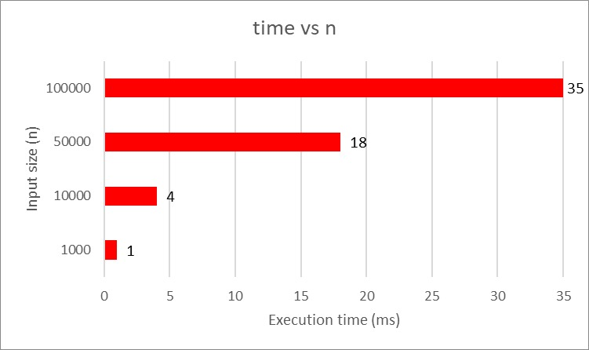
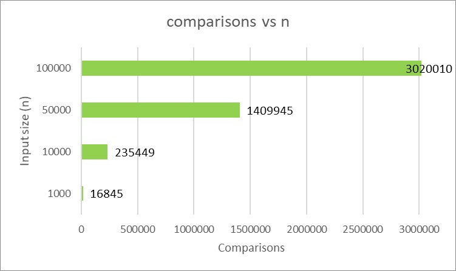
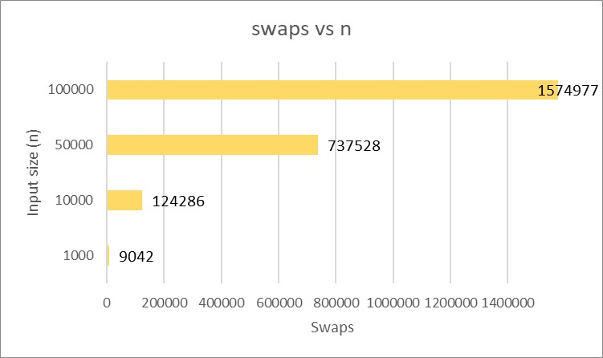
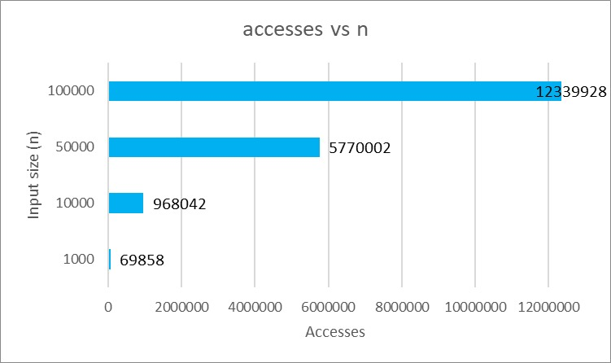

# Assignment 2 — Heap Sort (Student B, Pair 2)

**Student:** Balgatay Shynar
**Instructor:** Aidana Aidynkyzy  
**Date:** October 2025  

---

## Introduction
- Student A implements **Shell Sort** (my partner: Zhandos Gilazhev)
- Student B implements **Heap Sort** (me)
- Each student analyzes the partner’s code (peer review)

This assignment implements **Heap Sort** with performance tracking and benchmarks, and provides an empirical test of the theoretical complexity of the algorithm.

---

## Repository Structure
assignment2-heapsort/
├── src/main/java/
│  ├── algorithms/HeapSort.java # Heap Sort implementation
│  ├── metrics/PerformanceTracker.java # Comparisons, swaps, accesses, time
│  └── cli/BenchmarkRunner.java # CLI runner for benchmarks
├── src/test/java/
│  └── algorithms/HeapSortTest.java # Unit tests for Heap Sort
├── docs/
│  ├── performance-plots/ # Graphs (time, comps, swaps, accesses)
│  ├── performance-data/
│     └──heapsort-results.csv
│  └── analysis-report.pdf # Report on partner’s Shell Sort
├── README.md
└── pom.xml

---

## Features
- **Heap Sort** in-place implementation using bottom-up heapify.  
- **Performance metrics tracking:**  
  - Comparisons  
  - Swaps  
  - Array accesses  
  - Execution time (ms)  
- **Unit tests** covering edge cases: empty arrays, single element, duplicates.  
- **Benchmark CLI** to measure runtime for arrays of different sizes.  
- **Performance plots** showing empirical complexity growth.  

---

## Performance Plots

- Time vs Input size  
  

- Comparisons vs Input size  
  

- Swaps vs Input size  
  

- Accesses vs Input size  
  

## Performance Data

The raw benchmark results are available in CSV format:  
- [HeapSort Results](docs/performance-data/heapsort-results.csv)

---

## 🧮 Theoretical Complexity

- **Time Complexity:**  
  - Best Case: Ω(n log n)  
  - Average Case: Θ(n log n)  
  - Worst Case: O(n log n)  

- **Space Complexity:**  
  - In-place implementation, O(1) auxiliary space.  

---

## How to Run

### Run tests
```bash
mvn test
# Run benchmarks:
mvn compile exec:java -Dexec.mainClass=cli.BenchmarkRunner
```

---

## Deliverables

- HeapSort.java implementation (this repo).

- Benchmark results + plots.

- Report analyzing partner’s Shell Sort (in docs/analysis-report.pdf).

- Cross-review summary (joint document with partner).

---

## Git Workflow

- **main** — stable releases (tags: v0.1, v1.0)  
- **feature/algorithm** — HeapSort implementation  
- **feature/metrics** — performance tracker integration  
- **feature/testing** — JUnit test suite  
- **feature/cli** — benchmark runner  
- **feature/optimization** — future improvements  

Commit history follows a clean storyline:
- init: maven project structure, junit5, ci setup
- feat(metrics): add performance counters
- feat(algorithm): implement HeapSort
- test(algorithm): add unit tests
- feat(cli): benchmark runner
- docs(readme): add usage instructions
- release: v1.0
